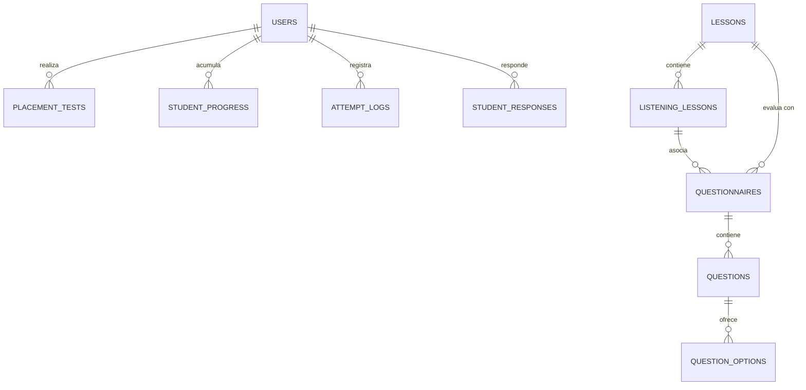

# 🦉 Agente Inglés UTBIS

> **Plataforma Institucional de Aprendizaje Adaptativo de Inglés**  
> Desarrollada para la **Universidad Tecnológica de Puebla (UTBIS)**.  
> Combina la pedagogía estructurada de **EF English Live / EF SET** con la gamificación inmersiva de **Duolingo** y tutoría pedagógica con **Google Gemini AI**.

---

## 📋 Tabla de Contenidos

1. [Visión General](#-visión-general)
2. [Arquitectura y Stack Tecnológico](#-arquitectura-y-stack-tecnológico)
3. [Ecosistema de Módulos y Funcionalidades](#-ecosistema-de-módulos-y-funcionalidades)
   - [Autenticación y Roles](#1-autenticación-y-roles)
   - [Examen de Ubicación (Placement Test)](#2-examen-de-ubicación-placement-test)
   - [Mapa de Niveles CEFR](#3-mapa-de-niveles-cefr)
   - [Estación de Lecciones Multimodal (Learn Station)](#4-estación-de-lecciones-multimodal-learn-station)
   - [Tutor Inteligente IA (Chat Copilot Búho)](#5-tutor-inteligente-ia-chat-copilot-búho)
   - [Paneles de Profesor y Administrador](#6-paneles-de-profesor-y-administrador)
   - [Sistema de Gamificación](#7-sistema-de-gamificación)
4. [Estructura del Proyecto](#-estructura-del-proyecto)
5. [Modelos de Base de Datos y Relaciones](#-modelos-de-base-de-datos-y-relaciones)
6. [Comandos de Consola (Artisan CLI)](#-comandos-de-consola-artisan-cli)
7. [Instalación y Puesta en Marcha](#-instalación-y-puesta-en-marcha)
8. [Configuración de Variables de Entorno](#-configuración-de-variables-de-entorno)
9. [Suite de Pruebas Automatizadas](#-suite-de-pruebas-automatizadas)
10. [Seguridad y Buenas Prácticas](#-seguridad-y-buenas-prácticas)

---

## 🎯 Visión General

**Agente Inglés UTBIS** es una solución integral orientada a potenciar las competencias lingüísticas en inglés de los estudiantes universitarios. El sistema acompaña al alumno desde su diagnóstico inicial hasta el dominio avanzado en el marco europeo (**CEFR A1 a C1**), ofreciendo retroalimentación inmediata asistida por IA generativa y evaluación fonética en tiempo real.

---

## 🛠 Arquitectura y Stack Tecnológico

| Capa | Tecnologías | Descripción |
| :--- | :--- | :--- |
| **Backend** | **PHP 8.2+** / **Laravel 11** | Arquitectura MVC, Eloquent ORM, Servicios desacoplados, Middlewares de seguridad y FormRequests. |
| **Frontend** | **Blade** / **Alpine.js v3** / **Vanilla CSS** | Componentes reactivos ligeros, diseño responsivo, temas Claro/Oscuro y modo de accesibilidad en escala de grises. |
| **Estilos** | **Tailwind CSS** + **Custom Design System** | Tokens semánticos de color HSL, botones con relieve 3D táctil (*btn-duo*) y tarjetas de vidrio translúcido (*glass-card*). |
| **Inteligencia Artificial** | **Google Gemini 2.0 Flash** / **OpenAI** / **Groq** | Evaluación fonética de Speaking, tutoría socrática en Chat y corrección gramatical adaptativa. |
| **Voz y Audio** | **Web Speech API** / **MediaRecorder API** | Motor TTS multilingüe con detección automática de idioma y grabador nativo de audio WebM/Opus. |
| **Base de Datos** | **MySQL** / **SQLite** | Soporte nativo para base de datos relacional con migraciones y seeders idempotentes. |

---

## 📦 Ecosistema de Módulos y Funcionalidades

### 1. Autenticación y Roles
* **Autenticación Dual:** Registro/login tradicional con contraseña segura (hashing `bcrypt`) y **Google OAuth 2.0** restringido a correos institucionales `@utbispuebla.edu.mx`.
* **Control de Acceso Basado en Roles (RBAC):**
  * `student`: Acceso a diagnóstico, ruta CEFR, actividades de lección y tutor IA.
  * `professor`: Supervisión de avances, métricas analíticas de estudiantes y grupos.
  * `admin`: Administración global de cuentas, roles, permisos y catálogo.
* **Middleware `EnsureAccountIsActive` & `CheckRole`:** Protección de acceso y validación de cuentas activas.

### 2. Examen de Ubicación (Placement Test)
* Diagnóstico inicial obligatorio para estudiantes antes de acceder al mapa de niveles.
* Banco estructurado de **60 preguntas calibradas** que evalúan habilidades de comprensión y gramática desde A1 hasta C1.
* **Temporizador integrado de 55 minutos** con autoguardado continuo en `sessionStorage` para evitar pérdida de progreso ante cierres accidentales.
* **Evaluación algorítmica y desbloqueo automático** del nivel CEFR obtenido.
* Mecanismo de reintento regulado (*retake*) que registra el historial completo de resultados.

### 3. Mapa de Niveles CEFR
* Organización visual por niveles estándar: **A1, A2, B1, B2, C1** subdivididos en submódulos (ej. 1.1, 1.2, 2.1).
* Bloqueo progresivo: Para avanzar, el alumno debe dominar las habilidades requeridas de la lección previa.
* Indicadores visuales de estado: *Dominado*, *En progreso*, *Desbloqueado por examen* y *Bloqueado*.

### 4. Estación de Lecciones Multimodal (Learn Station)
Cada lección se estructura en tres pilares de aprendizaje:
* **Reading & Grammar:** Textos de lectura guiada con cuestionarios de opción múltiple y respuesta abierta, validación instantánea contra el servidor y lectura asistida con sintetizador vocal IA.
* **Listening Studio:** Reproductor integrado de audios nativos, control de velocidad, transcripción opcional de audio y ejercicios de comprensión auditiva.
* **Speaking AI:**
  * Grabación directa desde el navegador (Web Audio API).
  * Envío seguro en base64 hacia el backend.
  * Evaluación mediante **Google Gemini AI**, proporcionando transcripción fonética de lo pronunciado, porcentaje de precisión, corrección gramatical y consejos de dicción.
* **Stepper de Actividades:** Permite alternar fluidamente entre múltiples ejercicios dentro de la misma lección con persistencia de respuestas.

### 5. Tutor Inteligente IA (Chat Copilot Búho)
* Asistente conversacional pedagógico adaptado automáticamente al nivel CEFR registrado del estudiante.
* **Voz Femenina Natural de IA:** Limpieza automática de markdown y emojis para una lectura fluida, conmutación inteligente entre español e inglés y selector de voces neuronales del sistema.
* **Escenarios Didácticos Preconfigurados:**
  * *Job Interview Practice* (Entrevistas de trabajo en inglés).
  * *Coffee Shop & Food* (Roleplay en situaciones cotidianas).
  * *Grammar Clinic* (Diferencias gramaticales y dudas frecuentes).
  * *Daily Routine & Fluency* (Conversación abierta para ganar fluidez).

### 6. Paneles de Profesor y Administrador
* **Panel del Profesor (`/professor/dashboard`):**
  * Búsqueda en tiempo real y filtrado de estudiantes institucionales.
  * Reportes de porcentaje de avance, XP total, lecciones concluidas y desglose de intentos.
* **Panel de Administración (`/admin/users`):**
  * CRUD completo de usuarios (creación, edición, reseteo de claves y asignación de roles).
  * Activación o suspensión inmediata de accesos.

### 7. Sistema de Gamificación
* **Experiencia (XP):** Asignación de puntos de experiencia por actividades aprobadas, pronunciaciones correctas y cuestionarios dominados.
* **Rachas de Aprendizaje (*Streaks*):** Conteo de días consecutivos de práctica activa en la plataforma.
* **Registro de Intentos (`AttemptLog`):** Trazabilidad histórica de calificaciones, tiempos y respuestas del estudiante.

---

## 📂 Estructura del Proyecto

```
agente-ingles-utbis/
├── app/
│   ├── Console/Commands/       # Comandos Artisan (importación de contenido, TTS, etc.)
│   ├── Contracts/              # Interfaces y contratos (AiProvider)
│   ├── Http/
│   │   ├── Controllers/        # Controladores web y API (Level, Placement, Chat, Admin...)
│   │   ├── Middleware/         # Middlewares (CheckRole, EnsureAccountIsActive)
│   │   └── Requests/           # Validaciones FormRequest tipadas
│   ├── Models/                 # Modelos Eloquent (User, Lesson, ListeningLesson, Question...)
│   ├── Providers/              # Proveedores de servicios (AppServiceProvider)
│   ├── Services/               # Lógica de negocio (GeminiService, GamificationService, TtsService...)
│   └── Support/                # Clases de soporte y normalizadores
├── config/                     # Archivos de configuración (services.php, app.php, etc.)
├── database/
│   ├── factories/              # Fábricas de datos para pruebas
│   ├── migrations/             # Migraciones estructuradas de base de datos
│   └── seeders/                # Seeders iniciales (Roles, Lecciones base)
├── docs/                       # Documentación técnica adicional
├── lang/es/                    # Archivos de localización y mensajes en español
├── public/                     # Assets públicos (imágenes, favicons, robots.txt)
├── resources/
│   ├── css/                    # Estilos CSS y sistema de diseño Duolingo/EF
│   ├── js/                     # Scripts JS (Alpine.js, AIVoice TTS Engine)
│   └── views/                  # Vistas Blade modulares
├── routes/
│   ├── api.php                 # Endpoints JSON para API y consumo móvil
│   ├── auth.php                # Rutas de autenticación Breeze / OAuth
│   └── web.php                 # Rutas de la aplicación web
└── tests/
    ├── Feature/                # Pruebas funcionales de integración y seguridad
    └── Unit/                   # Pruebas unitarias de servicios y utilidades
```

---

## 🗄 Modelos de Base de Datos y Relaciones



* **`User`:** Identidad, rol (`student`, `professor`, `admin`), nivel CEFR actual, XP y racha.
* **`PlacementTest`:** Registro de diagnósticos iniciales, puntajes y nivel asignado.
* **`Lesson`:** Unidad CEFR central (nivel, subnivel, objetivos pedagógicos).
* **`ListeningLesson`:** Material formativo multimodal (textos de lectura, guiones de listening, audio y modelo de speaking).
* **`Questionnaire` / `Question` / `QuestionOption`:** Banco de preguntas y opciones de opción múltiple o respuesta abierta.
* **`StudentProgress`:** Registro granular de dominio por habilidad (`reading`, `listening`, `speaking`).
* **`AttemptLog`:** Historial de intentos, respuestas emitidas y retroalimentación de IA.

---

## ⌨ Comandos de Consola (Artisan CLI)

El proyecto incluye comandos dedicados para la administración y carga de contenidos educativos:

```bash
# 1. Importar el banco de 60 preguntas del Placement Test desde Excel/CSV
php artisan content:import-placement-questions

# 2. Importar lecciones y audios vinculados desde Google Drive
php artisan content:import-listening-drive --level=A1

# 3. Importar cuestionarios de comprensión asociados a las lecciones
php artisan content:import-listening-questions

# 4. Generar archivos de audio mediante TTS para scripts de listening
php artisan content:generate-listening-audio
```

---

## 🚀 Instalación y Puesta en Marcha

### Requisitos Previos
* **PHP >= 8.2** con extensiones `pdo`, `mbstring`, `openssl`, `curl`, `fileinfo`.
* **Composer >= 2.x**
* **Node.js >= 18.x** y **npm**
* **MySQL** o **SQLite**

### Pasos de Instalación

```bash
# 1. Clonar el repositorio
git clone https://github.com/Tieid/agente-ingles-utbis.git
cd agente-ingles-utbis

# 2. Instalar dependencias de PHP y Node
composer install
npm install

# 3. Configurar el entorno local
cp .env.example .env
php artisan key:generate

# 4. Configurar base de datos en .env y ejecutar migraciones con datos iniciales
php artisan migrate --seed

# 5. Compilar assets del frontend
npm run dev

# 6. Levantar el servidor local
php artisan serve
```

Accede a `http://localhost:8000` en tu navegador.

---

## ⚙ Configuración de Variables de Entorno

Variables esenciales en el archivo `.env`:

```env
APP_NAME="Agente Inglés UTBIS"
APP_ENV=local
APP_URL=http://localhost:8000

# Base de datos (SQLite por defecto para desarrollo)
DB_CONNECTION=sqlite

# Autenticación Google OAuth (Opcional en local)
GOOGLE_CLIENT_ID=tu_google_client_id
GOOGLE_CLIENT_SECRET=tu_google_client_secret
GOOGLE_REDIRECT_URI="${APP_URL}/auth/google/callback"

# Proveedor de Inteligencia Artificial
AI_PROVIDER=gemini
GEMINI_API_KEY=tu_clave_api_de_google_gemini
GEMINI_MODEL=gemini-2.0-flash

# Proveedores alternativos (opcional)
OPENAI_API_KEY=
GROQ_API_KEY=
```

---

## 🧪 Suite de Pruebas Automatizadas

El proyecto cuenta con una cobertura de pruebas automatizadas mediante **PHPUnit / Pest** que validan la seguridad, integridad de datos y flujos de negocio:

```bash
# Ejecutar todas las pruebas
php artisan test

# Ejecutar pruebas con reporte de cobertura
php artisan test --coverage
```

### Áreas Validadas por Tests:
- Autenticación segura y restricción de dominio Google OAuth (`@utbispuebla.edu.mx`).
- Flujo completo de evaluación del Placement Test y preservación de borradores.
- Reglas de negocio en el desbloqueo progresivo de lecciones CEFR.
- Evaluación fonética con validación de audio (Base64/MIME) y resiliencia ante caídas de la API de IA.
- Control de acceso y autorización estricta en paneles de Profesor y Administrador.

---

## 🔒 Seguridad y Buenas Prácticas

1. **Protección de Credenciales:** Ninguna API Key o secreto se almacena en el repositorio; todo se gestiona mediante variables de entorno en `.env`.
2. **Consultas Seguras:** Uso exclusivo de sentencias preparadas mediante Eloquent ORM y Query Builder para prevenir inyecciones SQL.
3. **Validación Exhaustiva:** Todas las entradas de usuario se validan a través de `FormRequest` antes de ser procesadas por los controladores.
4. **Resiliencia en Cliente:** Autoguardado en `sessionStorage` y manejo de degradación elegante en síntesis vocal ante navegadores sin soporte de Web Speech API.

---

<p align="center">
  <b>Universidad Tecnológica de Puebla (UTBIS)</b><br>
  Campus AI · Excelencia Bilingüe y Tecnológica
</p># agente-ingles-utbis

# agente-ingles-utbis

